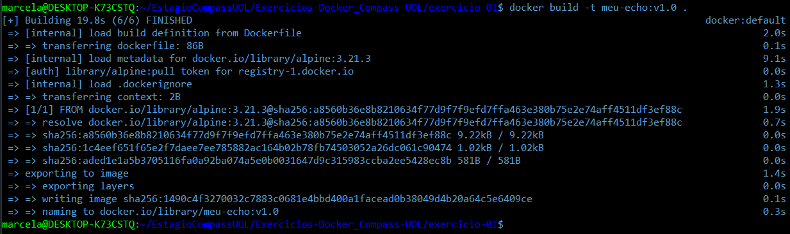
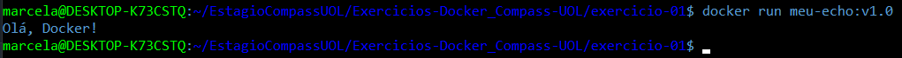

# Exercício 01

## 🎯 Objetivo

Crie um arquivo Dockerfile que utilize a imagem alpine como base e imprima a mensagem Olá, Docker! ao ser executada. Construa a imagem com o nome meu-echo e execute um container a partir dela. 

## ⚙️ Execução do Exercício

### 1. Crie um arquivo Dockerfile

```Dockerfile
FROM alpine:3.21.3
CMD ["echo", "Olá, Docker!"]
```

A instrução `FROM alpine:3.21.3` define a imagem base a ser utilizada.

A linha `CMD ["echo", "Olá, Docker!"]` define o comando padrão que será executado dentro do container quando ele for iniciado. Aqui, o comando `echo` imprime a mensagem no terminal.

**Observação importante:**
É uma boa prática sempre utilizar uma tag com versão específica ao definir a imagem base. Isso evita problemas relacionados a mudanças inesperadas na `latest`, garantindo que o comportamento do container seja reproduzível e estável.
Neste exercício, foi utilizada a versão `3.21.3` do Alpine justamente para seguir essa recomendação.

### 2. Construa a imagem Docker

```Bash
docker build -t meu-echo:v1.0 .
```



Esse comando deve ser executado no terminal, dentro da pasta onde está o `Dockerfile`. Ele serve para construir a imagem Docker com base nas instruções definidas nesse arquivo.

Veja o que cada parte do comando faz:

* `docker build`: inicia o processo de construção da imagem;

* `-t meu-echo:v1.0`: define o nome da imagem como `meu-echo` e adiciona a tag de versão `v1.0`, o que é uma boa prática, pois permite controle de versões e evita conflitos futuros;

* `.`: indica que o Docker deve usar a pasta atual como contexto de build, onde está localizado o `Dockerfile`.

### 3. Execute um container com base na imagem "meu-echo"

```Bash
docker run meu-echo:v1.0
```



Este comando deve ser executado no terminal, e ele instrui o Docker a criar e iniciar um container com base na imagem `meu-echo` que foi criada anteriormente com a tag `v1.0`.

Veja o que cada parte do comando faz:

* `docker run`: executa um novo container com base em uma imagem;

* `meu-echo:v1.0`: nome e tag da imagem que será usada para criar o container.

**Observação:** Como o Dockerfile foi configurado com o comando `CMD ["echo", "Olá, Docker!"]`, o container simplesmente imprime a mensagem `Olá, Docker!` no terminal e é finalizado logo em seguida, pois não há nenhum processo contínuo rodando dentro dele.