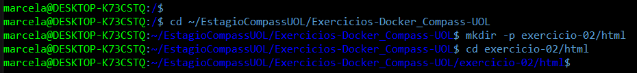
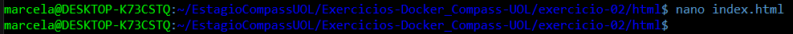
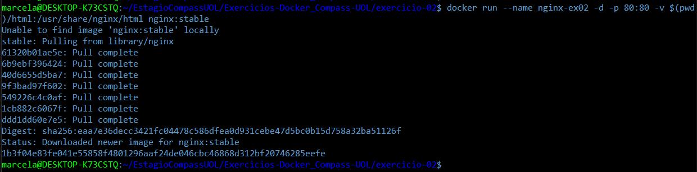
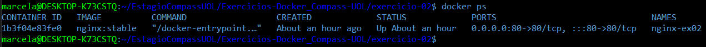
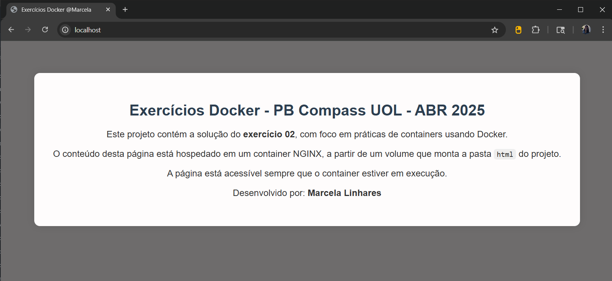

# Exercício 02

## 🎯 Objetivo

Crie um container com Nginx que sirva uma página HTML customizada (index.html). Monte um volume local com esse arquivo para que ele apareça na raiz do site (/usr/share/nginx/html). Acesse a página via http://localhost.  

## ⚙️ Execução do Exercício

### 1. Crie o arquivo "index.html" customizado

1.1. No terminal, vá até o local onde você salva seus exercícios e crie uma pasta para armazenar o arquivo `index.html`:

```Bash
cd ~/EstagioCompassUOL/Exercicios-Docker_Compass-UOL
mkdir -p exercicio-02/html
cd exercicio-02/html
```



O comando `mkdir -p` cria a pasta `html` dentro de `exercicio-02`. O `-p` garante que o caminho completo seja criado.

1.2. Dentro da pasta `html`, crie o arquivo com:

```Bash
nano index.html
```



Este será o HTML customizado que será exibido quando acessarmos o Nginx em `http://localhost`. O Nginx procura por este arquivo no caminho `/usr/share/nginx/html`, por isso vamos montar essa pasta no volume do container no próximo passo.

**O conteúdo completo do arquivo "index.html" pode ser visualizado diretamente neste repositório, no seguinte caminho:** [exercicio-02/index.html](index.html)

### 2. Execute o container com Nginx

2.1. No terminal, com o Docker em execução, volte para o diretório `exercicio-02` (caso não esteja nele):

```Bash
cd ~/EstagioCompassUOL/Exercicios-Docker_Compass-UOL/exercicio-02
```

2.2. Rode o seguinte comando para iniciar o container Nginx com o volume apontando para a pasta `html` criada no item anterior:

```Bash
docker run --name nginx-ex02 -d -p 80:80 -v $(pwd)/html:/usr/share/nginx/html nginx:stable
```



* `docker run`: cria e inicia um container

* `--name nginx-ex02`: define o nome do container como **"nginx-ex02"**

* `-d`: roda em segundo plano

* `-p 80:80`: mapeia porta 80 do host para a do container

* `-v $(pwd)/html:/usr/share/nginx/html`: mapeia a pasta **"html"** do seu computador (que contém o **"index.html"**) para a pasta **"/usr/share/nginx/html"** dentro do container — este é o local padrão onde o Nginx procura o arquivo **"index.html"** para exibir no navegador.

* `nginx:stable`: imagem estável do Nginx

2.3. Verifique se o container está em execução:

```Bash
docker ps
```



### 3. Acesse a página no navegador

Abra o navegador de sua preferência e digite:

```
http://localhost
```

✅ Você verá a página HTML customizada criada no passo 1.

