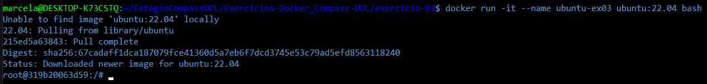
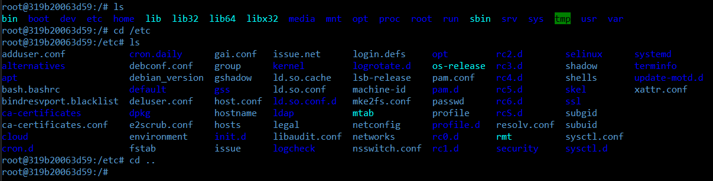
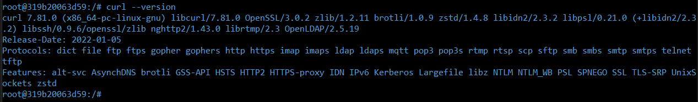

# Exercício 03

## 🎯 Objetivo

Inicie um container da imagem ubuntu com um terminal interativo (bash). Navegue pelo sistema de arquivos e instale o pacote curl utilizando apt.  

## ⚙️ Execução do Exercício

### 1. Execute um container com a imagem do Ubuntu em modo interativo

```Bash
docker run -it --name ubuntu-ex03 ubuntu:22.04 bash
```



* `docker run`: inicia um novo container

* `-it`: abre um terminal interativo

* `--name ubuntu-ex03`: nome do container

* `ubuntu:22.04`: imagem oficial do Ubuntu da versão 22.04

* `bash`: abre o terminal Bash dentro do container

### 2. Navegue pelo sistema de arquivos

Dentro do container rode os comandos:

```Bash
ls
cd /etc
ls
cd ..
```



* Com os comandos `ls`, `cd`, e `cd ..`, navegamos pelas pastas internas do container Ubuntu para conhecer sua estrutura.

### 3. Atualize a lista de pacotes com o **apt** e instale o **curl**

Dentro do container rode os comandos:

```Bash
apt update
```

* O comando `apt update` atualiza os índices de pacotes disponíveis nos repositórios, garantindo que você instale as versões mais recentes dos pacotes.

```Bash
apt install curl -y
```

* `apt install curl`: instala o pacote curl

* `-y`: responde "yes" automaticamente para qualquer pergunta do processo de instalação

### 4. Verifique se o **curl** foi instalado corretamente

Dentro do container rode o comando:

```Bash
curl --version
```



* O comando `curl --version` imprime a versão do **curl**, confirmando que ele foi instalado corretamente.