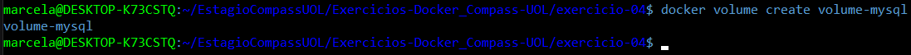
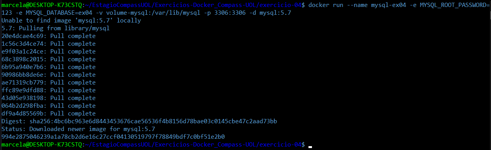
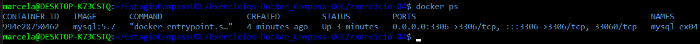
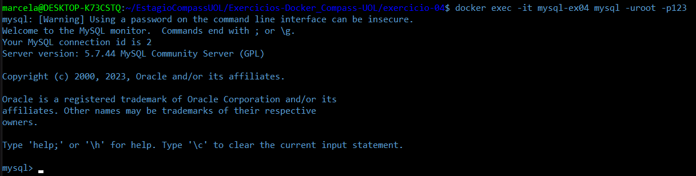
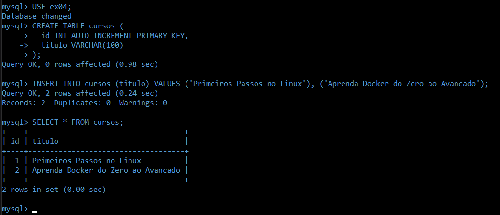
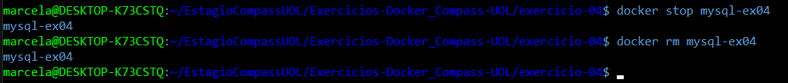
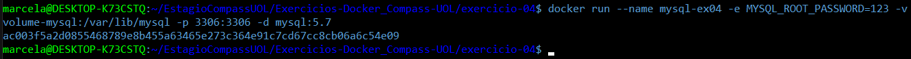
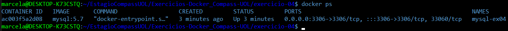
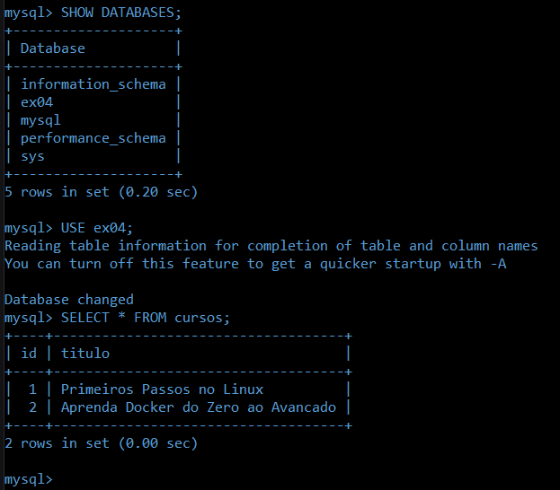

# Exercício 04

## 🎯 Objetivo

Suba um container do MySQL (pode usar a imagem mysql:5.7), utilizando um volume nomeado para armazenar os dados. Crie um banco de dados, pare o container, suba novamente e verifique se os dados persistem.   

## ⚙️ Execução do Exercício

### 1. Crie um volume nomeado

No terminal, execute o comando:

```Bash
docker volume create volume-mysql
```



* Esse comando cria um volume chamado `volume-mysql`, que será usado como armazenamento persistente do MySQL. Os dados do banco ficarão salvos fora do container, dentro desse volume.

### 2. Rode um container MySQL com o volume

No terminal, execute o comando:

```Bash
docker run --name mysql-ex04 -e MYSQL_ROOT_PASSWORD=123 -e MYSQL_DATABASE=ex04 -v volume-mysql:/var/lib/mysql -p 3306:3306 -d mysql:5.7
  ```



* `docker run`: inicia um novo container

* `--name mysql-ex04`: dá um nome ao container

* `-e MYSQL_ROOT_PASSWORD=123`: define a senha do usuário root

* `-e MYSQL_DATABASE=ex04`: cria automaticamente o banco **ex04**

* `-v volume-mysql:/var/lib/mysql`: monta o volume no local onde o MySQL salva os dados

* `-p 3306:3306`: expõe a porta padrão do MySQL

* `-d`: roda o container em segundo plano

* `mysql:5.7`: imagem oficial do MySQL, versão 5.7



### 3. Acesse o MySQL e crie uma tabela

3.1. No terminal, execute o comando:

```Bash
docker exec -it mysql-ex04 mysql -uroot -p123
```



* `docker exec`: diz ao Docker para executar um comando dentro de um container já em execução

* `-it`: ativa 2 modos: `-i`: modo interativo (manter entrada aberta), `-t`: aloca um terminal (TTY), para simular um terminal real

* `mysql-ex04`: nome do container onde o comando será executado

* `-uroot`: define o usuário de acesso ao MySQL (no caso, o root)

* `-p123`: informa a senha do root (que foi definida com a variável MYSQL_ROOT_PASSWORD)

3.2. Depois, execute os comandos abaixo **um por um** no terminal do MySQL:

```sql
USE ex04;

CREATE TABLE cursos (
  id INT AUTO_INCREMENT PRIMARY KEY,
  titulo VARCHAR(100)
);

INSERT INTO cursos (titulo) VALUES ('Primeiros Passos no Linux'), ('Aprenda Docker do Zero ao Avancado');

SELECT * FROM cursos;
```



* `USE ex04`: seleciona o banco criado automaticamente

* `CREATE TABLE`: cria uma tabela chamada **cursos**

* `INSERT INTO`: adiciona dois registros à tabela

* `SELECT *`: exibe os dados armazenados

Após, saia do MySQL utilizando **"exit"**.

### 4. Pare e remova o container

No terminal, execute os comandos:

```Bash
docker stop mysql-ex04
docker rm mysql-ex04
```



* Parar e remover o container simula uma falha ou reinicialização. Como os dados estão salvos em um volume, eles não serão perdidos.

### 5. Suba novamente o container com o mesmo volume

No terminal, execute o comando:

```Bash
docker run --name mysql-ex04 -e MYSQL_ROOT_PASSWORD=123 -v volume-mysql:/var/lib/mysql -p 3306:3306 -d mysql:5.7
  ```



* Aqui não é necessário passar `MYSQL_DATABASE=ex04`, pois o banco já existe no volume `volume-mysql`. O MySQL reconhecerá os dados antigos automaticamente.



### 6. Verifique a persistência dos dados

6.1. No terminal, execute o comando:

```Bash
docker exec -it mysql-ex04 mysql -uroot -p123
```

6.2. Depois, execute os comandos abaixo **um por um** no terminal do MySQL:

```sql
SHOW DATABASES;
USE ex04;
SELECT * FROM cursos;
```



* Esses comandos confirmam que os dados foram salvos corretamente no volume e **permaneceram intactos**, mesmo após a remoção do container original.

Após, saia do MySQL utilizando **"exit"**.