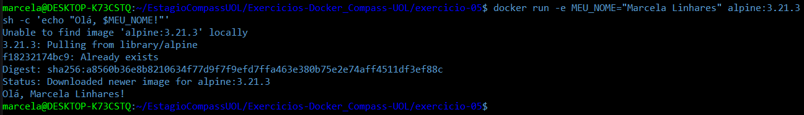

# Exercício 05

## 🎯 Objetivo

Crie um container com a imagem alpine passando uma variável de ambiente chamada MEU_NOME com seu nome. Execute o container e imprima o valor da variável com o comando echo. 

## ⚙️ Execução do Exercício

### 1. Execute o container com a imagem Alpine, variável de ambiente e comando echo

No terminal, execute o comando:

```bash
docker run -e MEU_NOME="Marcela Linhares" alpine:3.21.3 sh -c 'echo "Olá, $MEU_NOME!"'
```



* `docker run`: cria e executa um container

* `-e MEU_NOME="Marcela Linhares"`: define a variável de ambiente

* `alpine:3.21.3`: usa a imagem Alpine (leve e rápida)

* `sh -c`: abre um shell e executa o comando

* `'echo "Olá, $MEU_NOME!"'`: usa a variável de ambiente