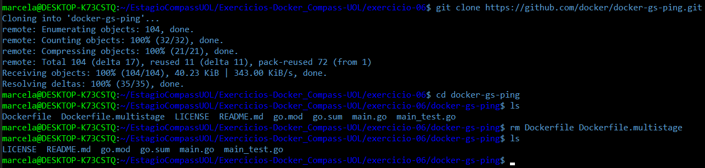
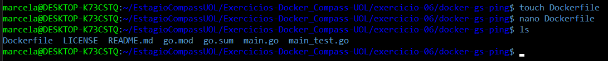
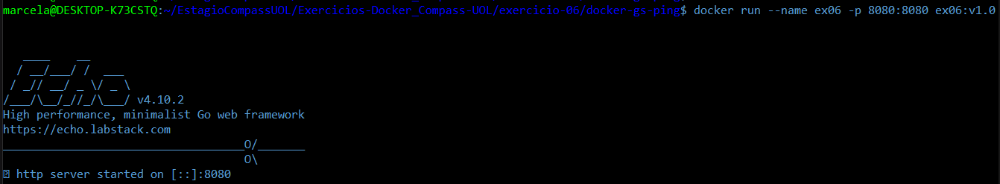
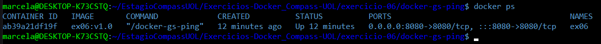
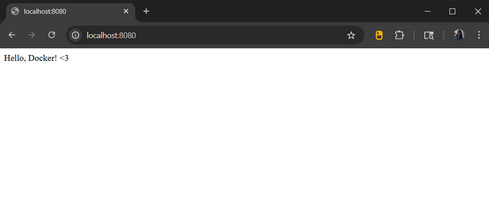
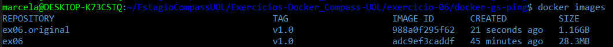

# Exercício 06

## 🎯 Objetivo

Utilize um **multi-stage build** para otimizar uma aplicação **Go**, reduzindo o tamanho da imagem final. Utilize para praticar o projeto [GS PING](https://github.com/docker/docker-gs-ping) desenvolvido em Golang. 

## ⚙️ Execução do Exercício

### 1. Clone o projeto **docker-gs-ping**

No terminal, execute o comando:

```bash
git clone https://github.com/docker/docker-gs-ping.git
```

Em seguida, acesse o diretório do projeto:

```bash
cd docker-gs-ping
```

⚠️ **Importante**: Delete qualquer Dockerfile existente no repositório original, para evitar conflitos com o seu.

```bash
rm Dockerfile
```



### 2. Crie o **Dockerfile** com Multi-stage Build

Crie um novo arquivo chamado Dockerfile (sem extensão), dentro do repositório `docker-gs-ping`:

```bash
touch Dockerfile
```

Abra o arquivo para edição:

```bash
nano Dockerfile
```

Cole o seguinte conteúdo:

```dockerfile
# Estágio de build
FROM golang:1.19 AS build-stage
WORKDIR /app

# Copia os arquivos do projeto
COPY . .

# Compila o binário
RUN CGO_ENABLED=0 GOOS=linux go build -o /docker-gs-ping

# Estágio final com imagem enxuta
FROM gcr.io/distroless/base-debian11 AS final-stage
WORKDIR /

# Copia apenas o binário gerado anteriormente
COPY --from=build-stage /docker-gs-ping /docker-gs-ping

EXPOSE 8080
ENTRYPOINT ["/docker-gs-ping"]
```

Salve o arquivo e feche: `Ctrl+O`, `Enter`, `Ctrl+X`.

🔍 O que esse Dockerfile faz?

* Utiliza multi-stage build para:

  * No primeiro estágio, compilar a aplicação em Go.

  * No segundo estágio, criar uma imagem final enxuta, apenas com o binário.

* Usa a imagem **distroless**, que é super leve, sem shell nem pacotes desnecessários.

* Isso reduz bastante o tamanho da imagem final.



**O conteúdo completo do arquivo "Dockerfile" pode ser visualizado diretamente neste repositório, no seguinte caminho:** [exercicio-06/docker-gs-ping/Dockerfile](docker-gs-ping/Dockerfile)

### 3. Construa a imagem Docker

Com o terminal ainda dentro da pasta `docker-gs-ping`, execute:

```bash
docker build -t ex06:v1.0 .
```

* `docker build`: inicia o processo de construção da imagem

* `-t ex06:v1.0`: define o nome da imagem como **ex06** e a tag da versão como **v1.0**

* `.`: indica que o Dockerfile está no diretório atual

Esse comando lê o `Dockerfile`, executa as instruções contidas nele, e cria uma imagem Docker pronta para rodar.

### 4. Rode o container a partir da imagem criada

4.1. No terminal, execute o seguinte comando para iniciar o container:

```bash
docker run -d --name ex06 -p 8080:8080 ex06:v1.0
```



* `docker run`:	executa um container com base na imagem especificada

* `-d`: rodar em segundo plano

* `--name ex06`: define o nome do container como **ex06**

* `-p 8080:8080`: faz o mapeamento da porta 8080 do host para a porta 8080 do container

* `ex06:v1.0`: indica a imagem (e versão) a ser utilizada para criar o container



4.2. Agora, no navegador, acesse:

```arduino
http://localhost:8080
```

Se estiver funcionando corretamente, a mensagem `Hello, Docker! <3` será exibida.



### 5. Verifique o tamanho da imagem final

Para confirmar a otimização do tamanho da imagem (graças ao multi-stage build), compare o tamanho da imagem criada com seu próprio Dockerfile com uma versão sem otimização (`ex06.original`).

No terminal:

```bash
docker images
```

📌 **Observação**: A imagem sem otimização `ex06.original` foi construída separadamente, apenas para fins de comparação de tamanho, e não faz parte do passo a passo principal deste exercício.

