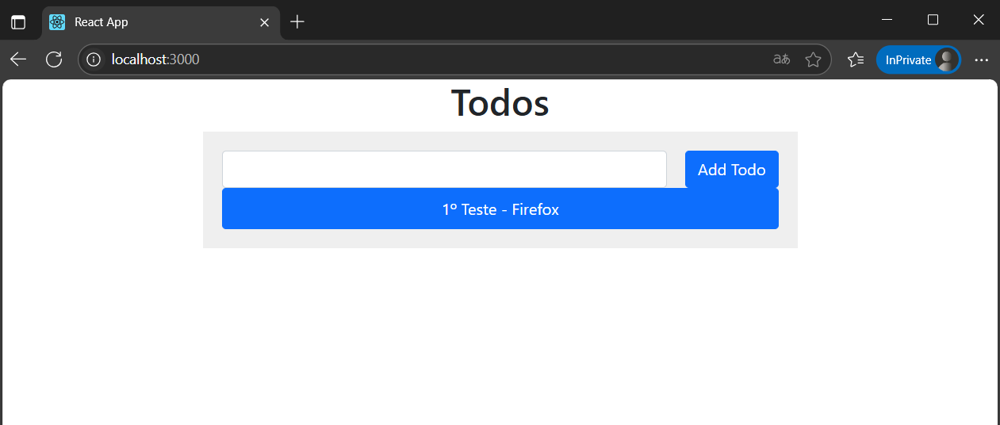

# Exercício 07

## 🎯 Objetivo

Crie uma rede Docker personalizada e faça dois containers, um **Node.js** e um **MongoDB**, se comunicarem, sugestão, utilize o projeto [React Express + Mongo](https://github.com/docker/awesome-compose/tree/master/react-express-mongodb).

## ⚙️ Execução do Exercício

### 1. Clone o repositório e mantenha somente a pasta do projeto necessário

No terminal, execute os seguintes comandos:

```bash
git clone https://github.com/docker/awesome-compose.git
cd awesome-compose
mv react-express-mongodb ../
cd ..
rm -rf awesome-compose
cd react-express-mongodb
ls
```


Agora, você ficará apenas com a pasta `react-express-mongodb` do projeto necessário.

### 2. Remova o arquivo original **compose.yaml**

Exclua o arquivo compose.yaml original:

```bash
rm compose.yaml
```


* O arquivo `compose.yaml` original foi excluído para evitar conflitos, já que no próximo item será criado um novo `docker-compose.yaml`.

### 3. Crie um novo arquivo **docker-compose.yaml**

Crie um novo arquivo chamado **docker-compose.yaml**, dentro do repositório **react-express-mongodb** e abra para edição:

```bash
nano docker-compose.yaml
```

Cole o seguinte conteúdo:

```yaml
services:
  backend:
    build: ./backend
    container_name: backend-app
    volumes:
      - ./backend:/usr/src/app
      - /usr/src/app/node_modules
    expose:
      - 3000
    depends_on:
      - mongo
    networks:
      - ex07-network

  frontend:
    build: ./frontend
    container_name: frontend-app
    ports:
      - "3000:3000"
    volumes:
      - ./frontend:/usr/src/app
      - /usr/src/app/node_modules
    depends_on:
      - backend
    networks:
      - ex07-network

  mongo:
    image: mongo:4.2.0
    container_name: mongo-db
    volumes:
      - mongo_data:/data/db
    expose:
      - 27017
    networks:
      - ex07-network

networks:
  ex07-network:

volumes:
  mongo_data:
```

Salve o arquivo e feche: `Ctrl+O`, `Enter`, `Ctrl+X`.


* `build`: informa ao Docker onde estão os arquivos **Dockerfile** para gerar a imagem

* `container_name`: nome personalizado do container

* `volumes`: sincroniza arquivos entre máquina local e container

* `ports`: faz o mapeamento entre a porta do host e a do container

* `expose`: exibe portas internamente entre os containers

* `depends_on`: garante a ordem de inicialização entre os serviços

* `networks`: define a rede Docker personalizada

* `volumes`:	Garante persistência dos dados do MongoDB mesmo com container parado

### 4. Execute os containers

No terminal, ainda dentro da pasta `react-express-mongodb`, execute:

```bash
docker-compose up --build -d
```

* `docker-compose`: executa múltiplos containers juntos

* `up`: sobe os serviços definidos no **docker-compose.yaml**

* `--build`: reconstrói as imagens antes de subir os containers

* `-d`: executa em modo de segundo plano


### 5. Teste a comunicação entre os containers

O frontend do projeto React se conecta com o backend Express e armazena as mensagens no MongoDB. As mensagens devem persistir entre os acessos nos navegadores.

5.1. Acesse no navegador Firefox e envie uma mensagem:

```arduino
http://localhost:3000
```


5.2. Abra o navegador Edge e veja se a mensagem aparece:



5.3. Envie outra mensagem no Edge:


5.4. Volte ao Firefox, atualize a página e veja se ambas as mensagens aparecem:

