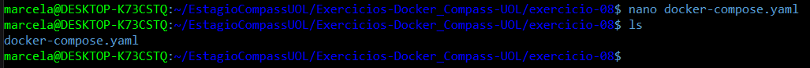
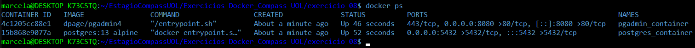
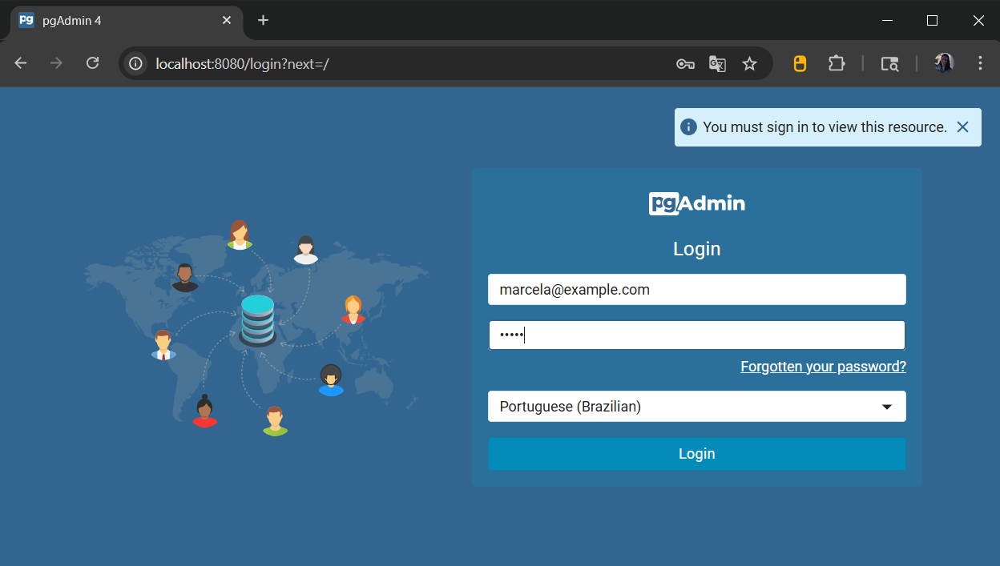
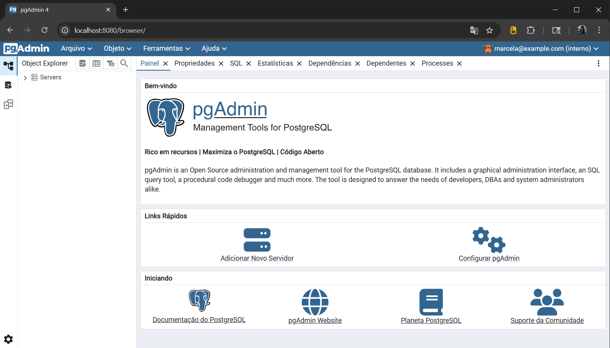
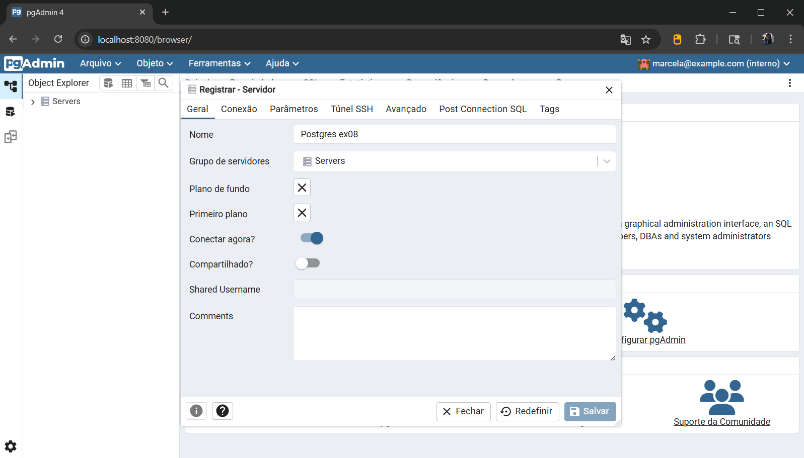
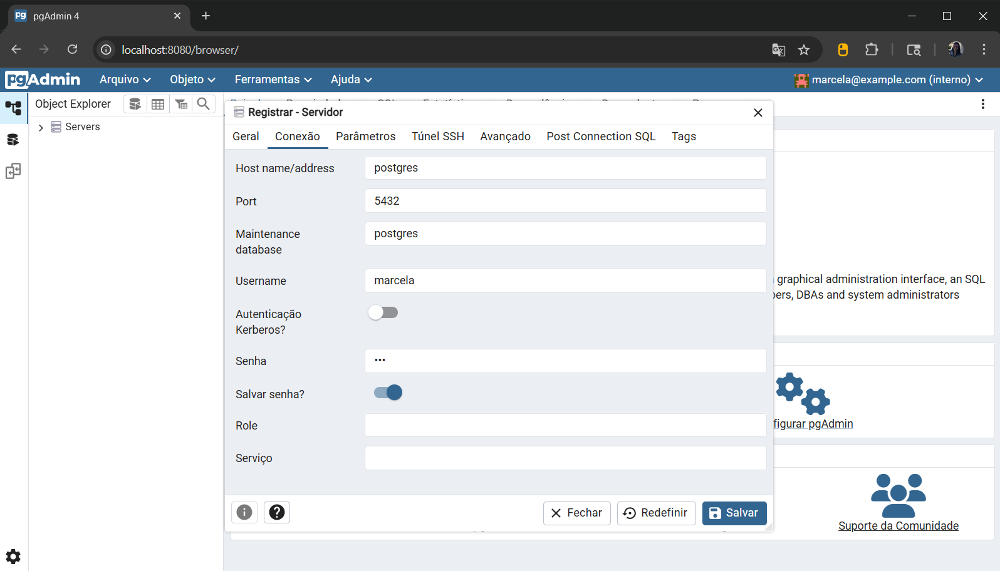
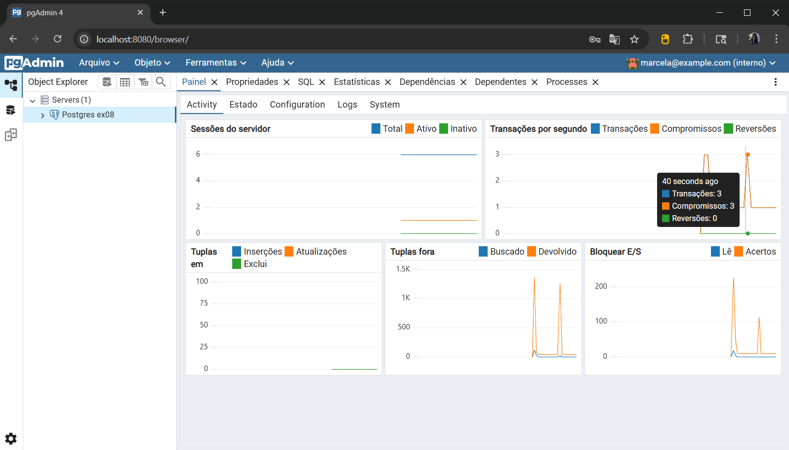

# Exercício 08

## 🎯 Objetivo

Utilize **Docker Compose** para configurar uma aplicação com um banco de dados **PostgreSQL**, use para isso o projeto [pgadmin](https://github.com/docker/awesome-compose/tree/master/postgresql-pgadmin). 

## ⚙️ Execução do Exercício

### 1. Crie o arquivo **docker-compose.yaml**

Crie um novo arquivo chamado **docker-compose.yaml**, dentro do repositório **exercicio-08** e abra para edição:

No terminal, execute o comando:

```bash
nano docker-compose.yaml
```

Cole o seguinte conteúdo:

```yaml
services:
  postgres:
    container_name: postgres_container
    image: postgres:13-alpine
    restart: always
    environment:
      POSTGRES_DB: ex08
      POSTGRES_USER: marcela
      POSTGRES_PASSWORD: 123
    volumes:
      - postgres-data:/var/lib/postgresql/data
    ports:
      - "5432:5432"

  pgadmin:
    container_name: pgadmin_container
    image: dpage/pgadmin4
    restart: always
    environment:
      PGADMIN_DEFAULT_EMAIL: marcela@example.com
      PGADMIN_DEFAULT_PASSWORD: admin
    ports:
      - "8080:80"
    depends_on:
      - postgres

volumes:
  postgres-data:
```

Salve o arquivo e feche: `Ctrl+O`, `Enter`, `Ctrl+X`.



* `services`: define os serviços que serão criados no Docker (containers).

* `postgres`: nome do serviço (usado como hostname na rede).

* `container_name`: nome fixo para o container, facilita identificação no **docker ps**.

* `image: postgres:13-alpine`: utiliza imagem leve do PostgreSQL versão 13.

* `restart: always`: garante que o container reinicie automaticamente em caso de falha ou reinicialização da máquina.

* `environment`: define variáveis de ambiente usadas pelo PostgreSQL.

* `POSTGRES_DB`: nome do banco de dados que será criado.

* `POSTGRES_USER`: nome do usuário padrão para autenticação no banco de dados PostgreSQL.

* `POSTGRES_PASSWORD`: senha de acesso ao banco.

* `volumes`: mapeia diretório do container para um volume persistente.

* `ports: "5432:5432"`: expõe a porta padrão do PostgreSQL para conexão externa via host.

* `pgadmin`: serviço do pgAdmin para acessar o banco via interface web.

* `image: dpage/pgadmin4`: imagem oficial do pgAdmin.

* `PGADMIN_DEFAULT_EMAIL`: e-mail para login no pgAdmin.

* `PGADMIN_DEFAULT_PASSWORD`: senha para login no pgAdmin.

* `"8080:80"`: acessa o pgAdmin pelo navegador usando porta 8080.

* `depends_on`: garante que o pgAdmin só inicie após o PostgreSQL estar rodando.

* `volumes`(fora de services): criação do volume nomeado **postgres-data**.

### 2. Execute os containers

No terminal, ainda dentro da pasta `exercicio-08`, execute:

```bash
docker-compose up --build -d
```

* `docker-compose`: executa múltiplos containers juntos

* `up`: sobe os serviços definidos no **docker-compose.yaml**

* `--build`: reconstrói as imagens antes de subir os containers

* `-d`: executa em modo de segundo plano



### 3. Acesse o pgAdmin no navegador e conecte ao banco

3.1. Acesse o navegador e vá até:

```arduino
http://localhost:8080
```

3.2. Faça login com:

* E-mail: `marcela@example.com`

* Senha: `admin`



3.3. Após login:

* Clique em **"Adicionar Novo Servidor"**.



3.4. Aba Geral:

* Nome: `Postgres ex08`



3.5. Aba Conexão:

* Host name/address: `postgres`

* Port: `5432`

* Username: `marcela`

* Senha: `123`

* Marque a opção **"Salvar senha"**.



3.6. Clique em **"Salvar"**.

