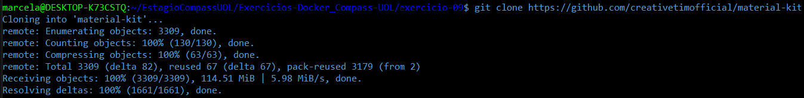
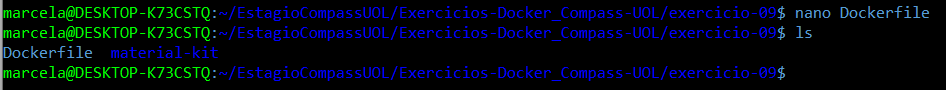
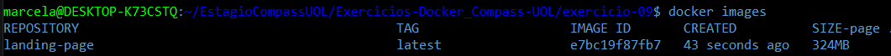
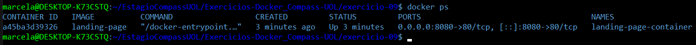
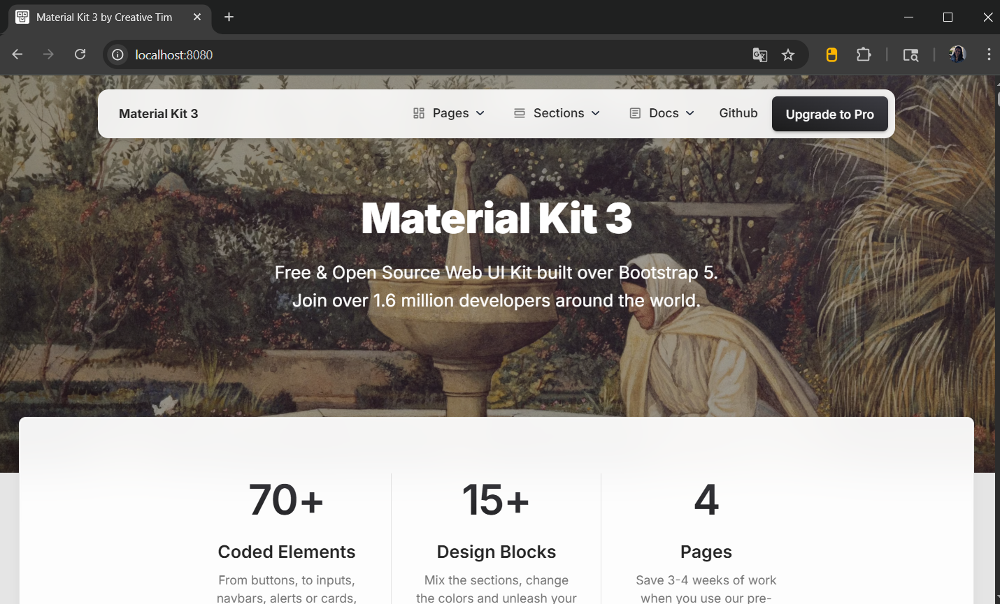

# Exercício 09

## 🎯 Objetivo

Construa uma imagem baseada no **Nginx** ou **Apache**, adicionando um site HTML/CSS estático. Utilize a [landing page do Creative Tim](https://github.com/creativetimofficial/material-kit) para criar uma página moderna hospedada no container. 

## ⚙️ Execução do Exercício

### 1. Clone o repositório da **landing page**

No terminal, dentro da pasta `exercicio-09`execute o comando:

```bash
git clone https://github.com/creativetimofficial/material-kit
```



### 2. Crie o **Dockerfile**

Crie um arquivo chamado Dockerfile (sem extensão), dentro do repositório `exercicio-09` e abra para edição com o comando:

```bash
nano Dockerfile
```

Cole o seguinte conteúdo:

```dockerfile
FROM nginx:stable
COPY material-kit /usr/share/nginx/html
EXPOSE 80
```

Salve o arquivo e feche: `Ctrl+O`, `Enter`, `Ctrl+X`.



* Essa imagem é baseada na versão estável do **Nginx**, copia os arquivos do site para a pasta padrão de hospedagem do Nginx (`/usr/share/nginx/html`) e expõe a porta 80.

### 3. Crie a imagem Docker

Ainda na pasta onde está o Dockerfile, em `exercicio-09`, execute:

```bash
docker build -t landing-page .
```



* O Docker cria uma imagem personalizada chamada `landing-page`, usando o `Dockerfile` que acabamos de definir.

### 4. Rode um container a partir da imagem

Execute o comando abaixo para criar e iniciar o container, mapeando a porta local `8080` para a porta interna `80` do container:

```bash
docker run -d -p 8080:80 --name landing-page-container landing-page
```

* Isso inicia um container chamado `landing-page-container`. Ao acessar `http://localhost:8080`, seu site estará no ar.



### 5. Verifique no navegador

Abra o navegador e acesse:

```arduino
http://localhost:8080
```

✅ Pronto! A **landing page do Creative Tim** está funcionando no navegador, servida por um container Docker com Nginx.

