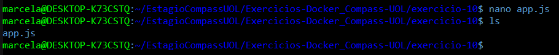
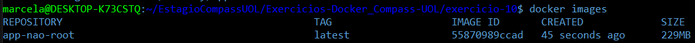
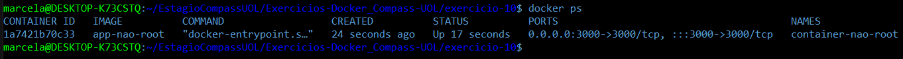

# Exercício 10

## 🎯 Objetivo

Ao rodar containers com o usuário root, você expõe seu sistema a riscos maiores em caso de comprometimento. Neste exercício, você deverá criar um Dockerfile para uma aplicação simples (como um script Python ou um 
servidor Node.js) e configurar a imagem para rodar com um usuário não-root. 
Você precisará: 

  a. Criar um usuário com useradd ou adduser no Dockerfile. 
  
  b. Definir esse usuário como o padrão com a instrução USER. 
  
  c. Construir a imagem e iniciar o container. 
  
  d. Verificar se o processo está rodando com o novo usuário usando docker exec <container> whoami. 

## ⚙️ Execução do Exercício

### 1. Crie uma Aplicação Simples

Crie um servidor HTTP simples com Node.js. Ele escuta requisições na porta 3000 e responde com uma mensagem.

No terminal, dentro da pasta `exercicio-10`, execute o comando:

```js
nano app.js
```

Cole o conteúdo abaixo:

```js
const http = require("http");

const hostname = "0.0.0.0";
const port = 3000;

const server = http.createServer((req, res) => {
  res.statusCode = 200;
  res.setHeader("Content-Type", "text/plain");
  res.end("Aplicação rodando como usuário não-root!\n");
});

server.listen(port, hostname, () => {
  console.log(`Servidor rodando em http://${hostname}:${port}/`);
});
```

Salve o arquivo e feche: `Ctrl+O`, `Enter`, `Ctrl+X`.



### 2. Crie a Imagem com Dockerfile

No Dockerfile abaixo, crie um novo usuário `appuser` com `useradd`, defina o diretório de trabalho como `/app`, copie o `app.js` para dentro da imagem, e use `USER` para garantir que o processo será executado por esse usuário.

Crie um arquivo chamado Dockerfile (sem extensão), dentro do repositório `exercicio-10` e abra para edição com o comando:

```bash
nano Dockerfile
```

Cole o seguinte conteúdo:

```dockerfile
FROM node:current-slim

# Cria usuário não-root
RUN useradd -m appuser

# Define diretório de trabalho
WORKDIR /app

# Copia o app.js
COPY app.js .

# Define o usuário não-root
USER appuser

# Expõe a porta usada pela aplicação
EXPOSE 3000

# Comando para iniciar o app
CMD ["node", "app.js"]
```

Salve o arquivo e feche: `Ctrl+O`, `Enter`, `Ctrl+X`.

### 3. Construa a Imagem

Execute no terminal (dentro da pasta onde está o Dockerfile e app.js):

```bash
docker build -t app-nao-root .
```



### 4. Rode o Container

Depois de construir a imagem, rode o container:

```bash
docker run -d --name container-nao-root -p 3000:3000 app-nao-root
```



### 5. Verifique o Usuário com whoami

Agora verifique se o processo está rodando com o usuário não-root:

```bash
docker exec container-nao-root whoami
```

🔎 Resultado esperado:

```bash
appuser
```

