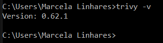
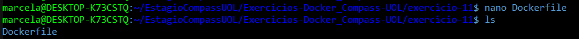
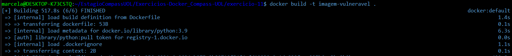
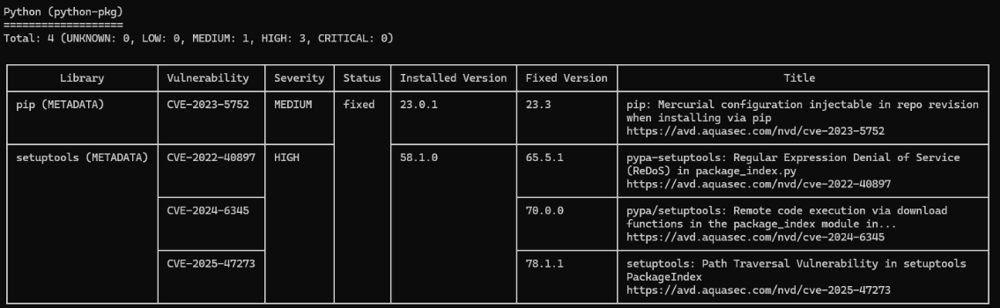

# Exercício 11

## 🎯 Objetivo

Trivy é uma ferramenta open source para análise de vulnerabilidades em imagens Docker. Neste exercício, você irá analisar uma imagem pública, como python:3.9 ou node:16, em busca de vulnerabilidades conhecidas. 

Você deverá:

e. Instalar o Trivy na sua máquina (via script ou pacote). 

f. Rodar trivy image `<nome-da-imagem>` para analisar. 

g. Identificar vulnerabilidades com severidade HIGH ou CRITICAL. 

h. Anotar os pacotes ou bibliotecas afetadas e sugerir possíveis ações 
(como atualização da imagem base ou substituição de dependências). 

## ⚙️ Execução do Exercício

### 1. Instalação do Trivy no Windows

Para instalar o Trivy no Windows:

1. Acesse a página de [releases do Trivy](https://github.com/aquasecurity/trivy/releases/tag/v0.62.1).

2. Baixe o executável adequado para o Windows (`trivy_0.62.1_windows-64bit.zip`, por exemplo).

3. Extraia o arquivo ZIP para uma pasta de sua preferência, como `C:\Users\Seu_Usuario\Desktop\Trivy`.

4. Adicione o caminho da pasta ao Path do sistema:

   * Pressione `Win + R`, digite `sysdm.cpl` e pressione Enter.

   * Vá até a aba Avançado e clique em Variáveis de Ambiente.

   * Em Variáveis do sistema, selecione Path e clique em Editar.

   * Clique em Novo e adicione o caminho da pasta onde o Trivy foi extraído.

   * Clique em OK para fechar todas as janelas.

   

### 2. Crie uma imagem python:3.9 via Dockerfile

```dockerfile
FROM python:3.9
```



Agora, em um terminal na pasta do desafio, execute:

```bash
docker build -t imagem-vulneravel .
```



### 3. Analise a imagem em busca de vulnerabilidades e identifíque-as:

Ao rodar o comando, foi possível identificar as seguintes vulnerabilidades do python:



* pip (METADATA) foi classificado com severidade **média**

* setuptools (METADATA) apresenta **alto risco**

Ambas as bibliotecas têm versões corrigidas disponíveis. Portanto, ao atualizá-las, as vulnerabilidades deixarão de existir.

### 4. Corrija as vulnerabilidades do python

Para isso, será feita uma mudança no Dockerfile:

```dockerfile
FROM python:3.9

RUN pip install --no-cache-dir --upgrade pip "setuptools>=70.0"
```
* Com isso, as versões vulneráveis de pip e setuptools serão substituídas por versões seguras.