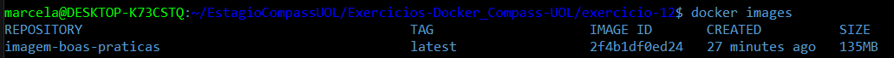

# Exercício 12

## 🎯 Objetivo

Após identificar vulnerabilidades com ferramentas como o Trivy, o próximo passo é corrigi-las. Imagens grandes e genéricas frequentemente trazem bibliotecas desnecessárias e vulneráveis, além de usarem o usuário root por padrão. Neste exercício, você irá trabalhar com um exemplo de Dockerfile com más práticas e aplicar melhorias para construir uma imagem mais segura e enxuta. Identifique as melhorias e gere uma nova versão de Dockerfile 

```dockerfile
Dockerfile vulnerável 
FROM python:3.9 
WORKDIR /app COPY requirements.txt . RUN pip install -r 
requirements.txt 
COPY . . 
CMD ["python", "app.py"] 
```

```requirements
flask==1.1.1 
```

```python
from flask import Flask 
app = Flask(__name__) 
@app.route("/") 
def hello_world(): 
return "<p>Hello, World!</p>" 
```

## ⚙️ Execução do Exercício

### 1. Crie o arquivo .dockerignore

O arquivo `.dockerignore` serve para evitar que arquivos desnecessários sejam enviados para o processo de build da imagem, ajudando a manter o build limpo e rápido.

```dockerignore
README.md
```

### 2. Refatore o Dockerfile

```dockerfile
FROM python:3.9.20-slim

RUN useradd -m marcela

WORKDIR /app

COPY requirements.txt .

RUN pip install --no-cache-dir -r requirements.txt

USER marcela

COPY . .

CMD ["python", "-m", "flask", "run", "--host=0.0.0.0"]
```

Principais mudanças aplicadas:

* Imagem enxuta (`python:3.9.20-slim`)

  Utilizar uma versão `slim` reduz bastante o tamanho da imagem e diminui as chances de encontrar vulnerabilidades.

* Criação de usuário sem privilégios

  Por padrão, containers Docker rodam como root, o que não é seguro. Criar um usuário comum reduz riscos de segurança.

* Instalação sem cache

  O parâmetro `--no-cache-dir` evita que o pip salve arquivos temporários, deixando a imagem mais leve.

* Uso do novo 

  O comando `USER marcela` garante que os próximos passos e a execução do container serão feitos com o usuário criado, não com root.

* Comando final (`CMD`)

  Inicia a aplicação Flask usando o modo recomendado para que ela fique acessível fora do container.

### 3. Atualize o **requirements.txt**

```txt
flask==2.0.0
jinja2==3.0.0
werkzeug==2.0.0
```

A versão original do Flask causava erros de importação, por isso, foram especificadas versões compatíveis entre si, garantindo o funcionamento correto da aplicação.

✅ Resultado
Com essas melhorias, a nova imagem está mais segura, leve e pronta para ambientes controlados, com menos chances de apresentar falhas críticas de segurança.

### 4. Crie a imagem Docker **imagem-boas-praticas**

```bash
docker build -t imagem-boas-praticas
```

* Isso vai criar a imagem usando o Dockerfile da pasta.



### 5. Rode o container com essa imagem

```bash
docker run -p 5000:5000 imagem-boas-praticas
```

* Isso inicia o app e deixa ele acessível no navegador:

Abra o navegador e vá até:

```arduino
http://localhost:5000
```

Você verá a frase: `Hello, World!`